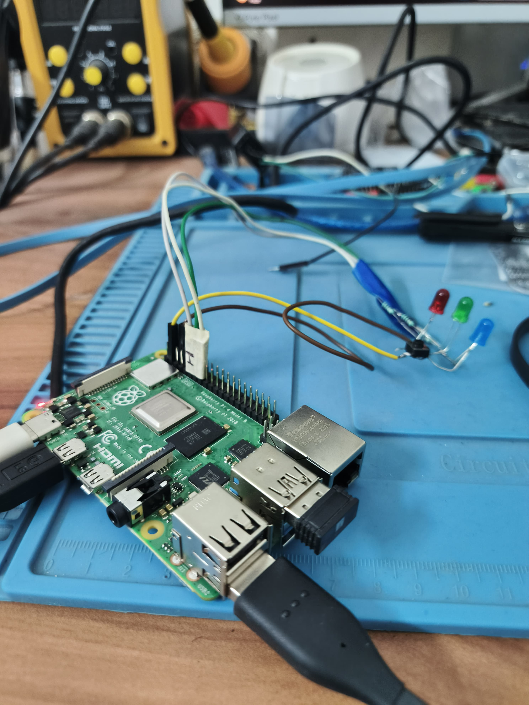

# Smart Product Detection System



An automated computer vision system that detects products using YOLO object detection and manages a digital cart via Firebase. Designed for Raspberry Pi 4 with LED status indicators.

## Features

- 🛒 Automatic product detection and cart management
- 📷 Real-time camera processing
- 🔴🟢🔵 LED status indicators (Red=No detection, Green=New Item added to cart, Blue=Quantity Updated)
- ☁️ Firebase cloud synchronization
- 🤖 Auto-start on boot

## Hardware Requirements
| Component              | Specification                    |
|------------------------|----------------------------------|
| Raspberry Pi           | 4 (4GB+ recommended)             |
| Camera                 | Official Pi Camera or USB webcam |
| LEDs                   | Red, Green, Blue                 |
| Resistors              | 220Ω (x3)                        |

## Option 1 - One step Initialization 

- Create a firebase project  
- Download Firebase Admin SDK 
- Rename it as serviceAccountKey.json 
- Move file to Cart_system_raspberryPi/
Then run this :

On Windows:
```bash
mkdir CartSystem
cd CartSystem
python -m venv cart_env
Set-ExecutionPolicy Unrestricted -Scope Process
.\cart_env\Scripts\activate
pip install numpy firebase-admin ultralytics pillow tk RPi.GPIO
git clone https://github.com/raahulmorya/Cart_system_raspberryPi
cd Cart_system_raspberryPi
```

On Windows:
```bash
mkdir CartSystem
cd CartSystem
python -m venv cart_env
source cart_env/bin/activate
pip install numpy firebase-admin ultralytics pillow tk RPi.GPIO
git clone https://github.com/raahulmorya/Cart_system_raspberryPi
cd Cart_system_raspberryPi
```
Then switch to [Running the System on Window/Linux](#running-the-system-on-windowlinux)
 
## Option 2 - Create a Virtual Environment
Use the following command to create a virtual environment named myenv:

```bash
python -m venv cart_env
```
This will create a directory cart_env/ containing a standalone Python environment.

## Activate the Virtual Environment

On Windows
```bash
Set-ExecutionPolicy Unrestricted -Scope Process
.\cart_env\Scripts\activate
```

On Linux
Activate it using this command:
```bash
source cart_env/bin/activate
```

Once activated, your terminal will show (cart_env) at the beginning of the prompt.

## Installation

On Windows
```bash
pip install numpy firebase-admin ultralytics pillow tk
```

On Linux
```bash
pip install numpy firebase-admin ultralytics pillow tk 
```
On Linux(Raspberry Pi)
```bash
# 1. Install dependencies
sudo apt update && sudo apt install -y python-pip python-opencv

# 2. Install Python packages
pip install numpy firebase-admin ultralytics pillow tk RPi.GPIO

# 3. Enable camera
sudo raspi-config
# → Interface Options → Camera → Enable
```

## GPIO Wiring
- Green LED  → GPIO 17
- Blue LED   → GPIO 27  
- Red LED    → GPIO 22
- All GND    → Ground (via 220Ω resistors)

## Firebase Setup

- Create Firestore database and name it anything
- Place your serviceAccountKey.json in the project root

Create Collections
```bash
python create_db_structure.py
```

## Running the System on Window/Linux

To test on Windows/Linux
```bash
python detect_products.py
```
If camera not detected Change cv2.VideoCapture(0, backend) with cv2.VideoCapture(1, backend)

## Running the System on Raspberry Pi 4
Manual Start
```bash
python raspberry_pi_detect_products.py
```

Auto-start (systemd)
```bash
sudo cp systemd/product_scanner.service /etc/systemd/system/
sudo systemctl enable --now product_scanner
```

## Cart and Checkout
To view Real-Time cart items
In new Terminal
```bash
python smart_cart.py
```
Proceed for checkout with Invoice Generation
